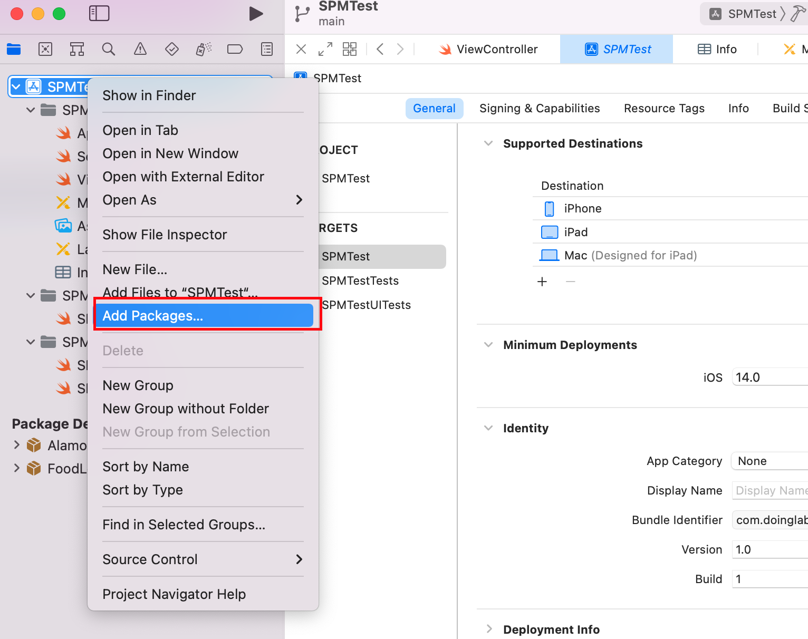
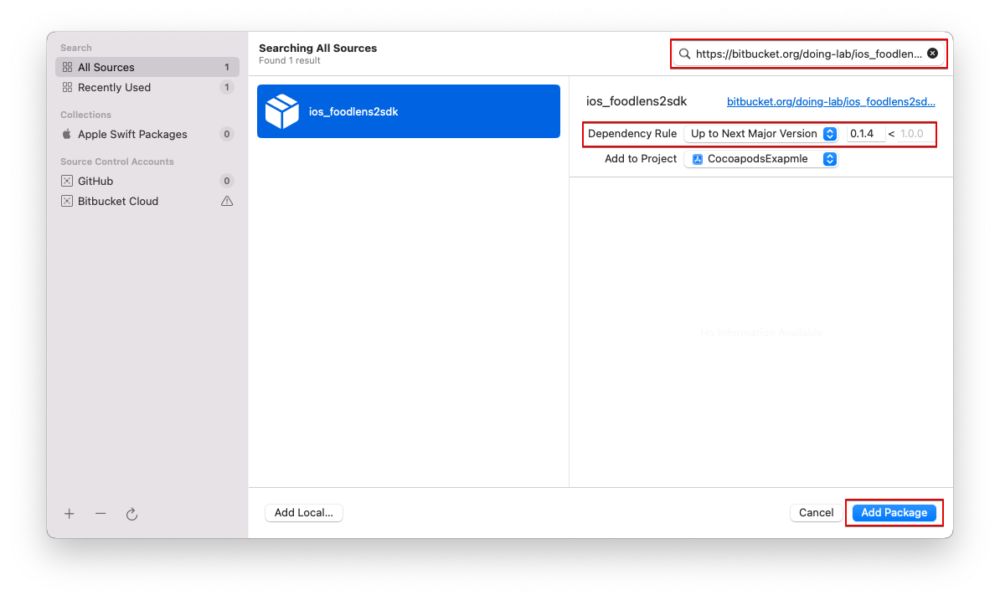

# iOS FoodLens SDK Manual

FoodLens functionality is available using the FoodLens SDK for iOS.

## Requirements

- iOS Ver 13.0 or higher
- Swift Version 4.2 or higher


## Installation

```swift
import FoodLens2
```

### CocoaPods
1. Add below into your `Podfile`:  

```
pod 'FoodLens2'
```

2. If `pod install` is not searched for `Foodlens2`:

```
pod install --repo-update
```


### Swift Package Manager(SPM)
Select `File` -> `AddPackage` or `ProjectSetting` -> `AddPackage`  
Search [https://bitbucket.org/doing-lab/ios_foodlens2sdk.git](https://bitbucket.org/doing-lab/ios_foodlens2sdk.git)





## Using FoodLens

### Authentication
```swift
// Please enter Company Token and App Token
FoodLens.createFoodLensService(companyToken: "<Company Token>", appToken: "<App Token>")
```

### Predict Food Images
FoodLens provide three ways of concurrency.

#### 1. Closure
```swift
func predict(image: UIImage, complition: @escaping (Result<RecognitionResult, Error>) -> Void)
```

```swift
FoodLens.shared.predict(image: image) { result in
    switch result {
    case .success(let response):
        DispatchQueue.main.async {
            self.predictResponses = response
        }
    case .failure(let error):
        print(error.localizedDescription)
    }
}
```

#### 2. Combine
```swift
func predictPublisher(image: UIImage) -> AnyPublisher<RecognitionResult, Error>
```

```swift
FoodLens.shared.predictPublisher(image: image)
    .sink(receiveCompletion: { output in
        switch output {
        case .finished:
            print("Publisher finished")
        case .failure(let error):
            print(error.localizedDescription)
        }
    }, receiveValue: { response in
        DispatchQueue.main.async {
            self.predictResponses = response
        }
    })
    .store(in: &self.cancellable)
```

#### 3. async/await
```swift
func predict(image: UIImage) async -> Result<RecognitionResult, Error>
```

```swift
Task {
    let result = await FoodLens.shared.predict(image: image)
    switch result {
    case .success(let response):
        DispatchQueue.main.async {
            self.predictResponse = response
        }
    case .failure(let error):
        print(error.localizedDescription)
    }
}
```


### Other Settings

#### Set language

```swfit
FoodLens.setLanguage(.en)      // English(default)
FoodLens.setLanguage(.ko)      // Korean
FoodLens.setLanguage(.current) // Device Setting
```

#### Set Auto Rotate
- Return box coordinates based on 'Top Left' orientation of image exif

```swift
FoodLens.setAutoRotate(true)
```

- Return box coordinates based on source image orientation

```swift
FoodLens.setAutoRotate(false)
```

#### Setting an Independent FoodLens Server Address

```Swift
// Please enter URL String
FoodLens.setCustomURL("<URL>")
```

## SDK Detailed specification
[API Documents](https://doinglab.github.io/foodlens2sdk/ios/index.html)

## SDK Example
[Sample Code](https://github.com/doinglab/FoodLens2SDK/tree/main/IOS/SampleCode/)


## Author
hyunsuk.lee@doinglab.com


## License
FoodLens is available under the MIT license. See the LICENSE file for more info.
